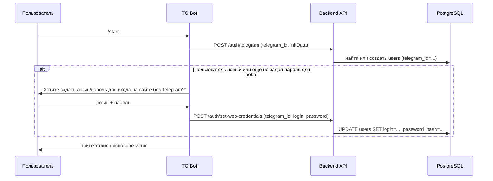
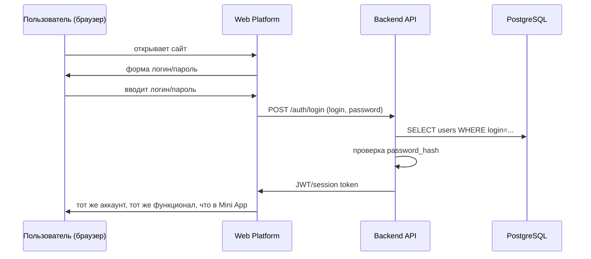
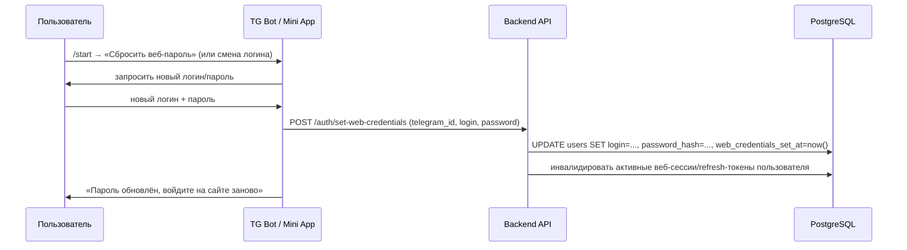
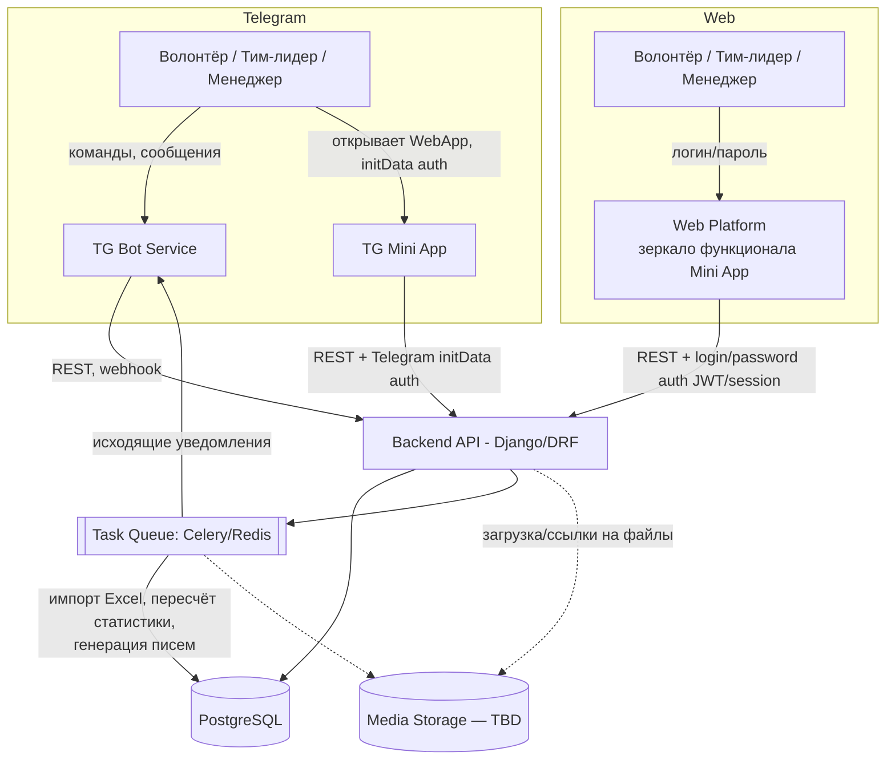
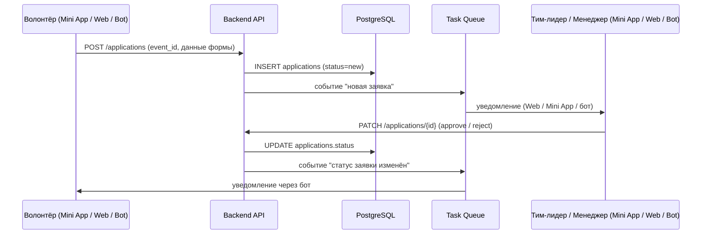
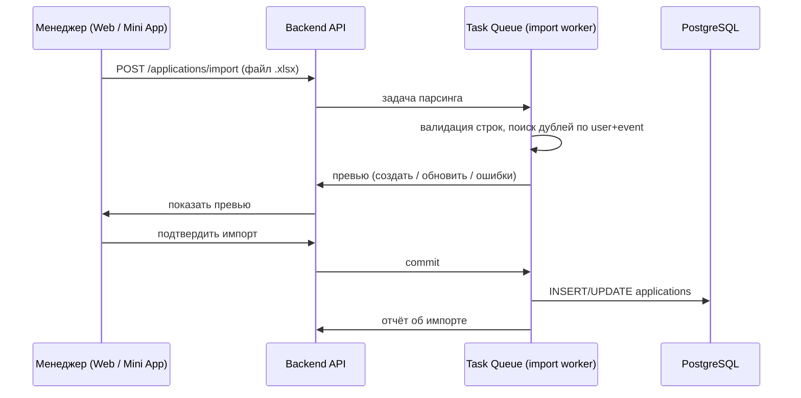
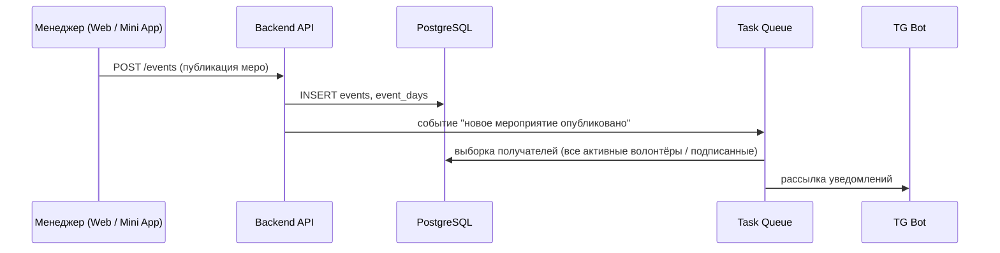

# Архитектура платформы Волонтёрского центра

> Документ описывает, как взаимодействуют компоненты платформы: TG-бот, TG Mini App, Web-платформа (дублирующая функционал для менеджеров и волонтёров), бэкенд, БД, очередь задач и (в будущем) хранилище медиафайлов.

---

## 1. Компоненты системы

| Компонент | Назначение | Хост |
|---|---|---|
| **TG Bot** | Канал уведомлений и быстрого взаимодействия: статистика, список меро, оповещения, благодарности | Отдельный сервис (webhook/polling) |
| **TG Mini App** | UI внутри Telegram для волонтёров **и** менеджеров/тим-лидеров: лента меро, карточки, профили, аналитика, загрузка фото, обработка заявок, загрузка Excel | Frontend внутри Telegram WebView |
| **Web Platform** | Полный зеркальный клиент функционала Mini App — доступен волонтёрам, менеджерам и тим-лидерам без необходимости ВПН/Telegram. Идентичный функционал, отдельный хостинг | Отдельный хост (веб, публично доступен) |
| **Backend API** | Единая точка бизнес-логики и доступа к данным (Django + DRF) | Отдельный хост |
| **PostgreSQL** | Основное хранилище данных (структура — см. `db.md`) | Managed DB / отдельный хост |
| **Task Queue (Celery/Redis или аналог)** | Асинхронные задачи: импорт Excel, пересчёт статистики, рассылка уведомлений, генерация писем | Отдельный сервис |
| **Media Storage** | Хранение фото мероприятий, файлов-шаблонов писем, аватаров и т.п. | **Не спроектировано — см. раздел 5** |

**Ключевой архитектурный принцип:** TG Bot, TG Mini App и Web Platform — это независимые *клиенты* одного и того же Backend API. Бизнес-логика (правила обработки заявок, подсчёт статистики, ACL) существует **в одном месте** — в Backend API, а не дублируется в разных сервисах.

**Важное уточнение (изменение относительно предыдущей версии):** Web Platform — это не отдельная "панель менеджера", а **полный дубликат функционала TG Mini App для всех ролей** (волонтёр, тим-лидер, менеджер). Причина существования отдельного веб-хоста — не разделение ролей, а разделение **каналов доступа**: работа внутри Telegram в текущих условиях требует ВПН, а Web Platform должна быть доступна без ВПН — для этого нужен независимый от Telegram способ входа (см. раздел 2.1).

Таким образом:
- Функционал (экраны, формы, отчёты, загрузка Excel, загрузка фото и т.д.) — **общий**, реализуется один раз на уровне API и переиспользуемых фронтенд-компонентов.
- Различается только: (a) точка входа/хостинг, (b) способ аутентификации.

---

## 2.1 Аутентификация: два способа входа в один и тот же аккаунт

Один пользователь (волонтёр, тим-лидер или менеджер) = одна запись в `users`, но два независимых способа подтвердить, что это он:

| Канал | Способ входа | Когда создаётся |
|---|---|---|
| **TG Bot / TG Mini App** | Telegram `initData` (проверка подписи, `telegram_id`) — пользователь **не вводит пароль**, бот/мини-апп сразу знает, кто перед ним | При первом обращении к боту (`/start`) |
| **Web Platform** | Логин + пароль (классическая форма входа) | Пароль задаётся **при первом касании с ботом** — во время авторизации в Telegram бот предлагает установить логин/пароль для последующего входа на сайте |

### Логика "первого касания"



### Вход через Web Platform



### Ключевые следствия для модели данных `users`

Нужны дополнительные поля (зафиксировать в `db.md`):
- `telegram_id` (существующее, обязательное для TG-канала, nullable в теории — но на практике всегда есть, т.к. аккаунт создаётся только через бота)
- `login` (nullable до первого касания с ботом / до момента установки веб-доступа; unique)
- `password_hash` (nullable, устанавливается вместе с `login`)
- `web_credentials_set_at` (timestamp, для аналитики/техподдержки)

**Важно:** аккаунт **всегда** создаётся через Telegram (`telegram_id` — первичный источник идентичности). Веб-логин/пароль — это *дополнительный* способ входа в уже существующий аккаунт, а не альтернативный путь регистрации. Самостоятельная регистрация через веб без Telegram — **не предусмотрена**: без создания/авторизации через Telegram на сайт войти нельзя.

---

## 2.2 Сброс и смена веб-пароля

Self-service восстановления пароля на сайте **нет** (нет доверенного канала: email не обязателен, «забыл пароль» на сайте недоступен). Сброс идёт только через Telegram, где личность уже подтверждена `initData`/`telegram_id`.



- Тот же эндпоинт `POST /auth/set-web-credentials` используется и для первичной установки, и для сброса.
- При смене пароля все активные веб-сессии пользователя инвалидируются (см. 2.3).

---

## 2.3 Сессии Web Platform: JWT lifetime и logout

- **Схема токенов:** короткоживущий **access-токен** (JWT, ~15–30 мин) + долгоживущий **refresh-токен** (~30 дней, хранится в httpOnly-cookie).
- **Login (`POST /auth/login`)** выдаёт пару access+refresh. Access передаётся в заголовке `Authorization`, refresh — в защищённой cookie.
- **Обновление (`POST /auth/refresh`)** меняет истёкший access по действительному refresh.
- **Logout (`POST /auth/logout`)** отзывает refresh-токен (сервер ведёт список активных/отозванных refresh-токенов на пользователя).
- **Инвалидация:** при смене пароля (2.2) или блокировке пользователя (`status='blacklisted'`) все refresh-токены отзываются — доступ к сайту прекращается.
- **Mini App / Bot** этот механизм не используют: там аутентификация на каждый запрос идёт через свежий Telegram `initData`, отдельная сессия не нужна.

---

## 3. Диаграмма компонентов



---

## 4. Ключевые сценарии взаимодействия

Все сценарии ниже идентичны независимо от того, через какой клиент (TG Mini App или Web Platform) действует пользователь — различается только транспорт аутентификации на входе в API. Роль пользователя (волонтёр/тим-лидер/менеджер) определяется ACL на уровне Backend API, а не тем, каким клиентом он пользуется.

### 4.1 Подача и обработка заявки на мероприятие



### 4.2 Массовый импорт заявок из Excel (менеджер, через Web или Mini App)



### 4.3 Закрытие смены → пересчёт статистики → благодарность

```mermaid
sequenceDiagram
    participant TL as Тим-лидер (Web / Mini App)
    participant API as Backend API
    participant DB as PostgreSQL
    participant Q as Task Queue
    participant BOT as TG Bot

    TL->>API: PATCH /participations (status: attended / absent_*, hours)
    API->>DB: UPDATE participations
    API->>Q: событие "участие подтверждено"
    Q->>DB: пересчёт users.total_hours / season_hours / *_event_count
    Q->>DB: пересчёт churn (если absent_unexcused: +штраф; при достижении порога — блэклист)
    Q->>DB: если season_hours >= pgas_hours_threshold — признак «Звёздочка»
    Q->>BOT: уведомление; ссылка на скачивание письма (генерируется на лету, если у меро задан letter_id)
```

### 4.4 Оповещение о новом мероприятии



---

## 5. Хранилище медиафайлов — открытый вопрос

Статус: **не спроектировано**, но обязательный компонент. Зафиксировано как техдолг/будущая работа.

Известные требования (из описания задачи):
- Поддержка фото в mini app и на Web Platform (минимум — карточка мероприятия).
- Вероятно понадобится: аватар волонтёра.
- Файлы-**шаблоны** благодарственных писем (`thank_you_letter_templates.pattern_link`). Персональные PDF писем **не хранятся** — генерируются на лету при скачивании (подстановка ФИО), см. `db.md`. В хранилище лежит только шаблон.

Что стоит решить отдельным ADR (architecture decision record) до реализации соответствующих модулей:
1. Провайдер: S3-совместимое объектное хранилище (например, Yandex Object Storage / MinIO self-hosted / Cloudflare R2) — конкретный выбор здесь не делается, это отдельное решение.
2. В БД хранить **только** ссылку/ключ объекта, не сами файлы (уже заложено в подход выше).
3. Приватность: файлы-шаблоны писем — приватный доступ (менеджеры), фото мероприятий — публичные.
4. Лимиты: допустимые форматы, максимальный размер, необходимость модерации загруженных пользователями фото.
5. CDN перед публичными файлами (фото меро), если будет ощутимая нагрузка на чтение.
6. Загрузка файлов должна одинаково работать из Web Platform и из TG Mini App — оба идут через один и тот же `POST /media/upload` на Backend API.

До принятия решения модели данных, где нужны медиафайлы, стоит проектировать с абстрактным полем `media_key`/`media_url` (nullable), чтобы не переделывать миграции задним числом.

---

## 6. Архитектурные решения по ранее открытым вопросам

Все ключевые вопросы закрыты. Ниже — принятые решения (детали моделей — в `db.md`).

| # | Вопрос | Решение |
|---|---|---|
| 1 | Расхождения схемы `db.md` и `reports.md` | Сведены к единым именам: таблица пользователей — `users`; поля-ссылки — `*_link`; момент обработки заявки — `applications.assigned_at`; локация дня — `event_days.location_id`. |
| 2 | Таблица «выданных» благодарственных писем | **Не нужна.** Письма не хранятся: связь меро↔шаблон через `events.letter_id → thank_you_letter_templates`, PDF генерируется на лету подстановкой ФИО. |
| 3 | Модель `churn` | Кэш-поле `users.churn_score` (FLOAT) + лог по сезонам `churn_history`. Поле `event_staff.churn_rate` удалено. Формула и carryover — в `db.md`, бизнес-правило 9. |
| 4 | Внутренний профиль тим-лидера | **Отсутствует.** Всё, что отличает ТЛ от волонтёра (кол-во меро как ТЛ, дата назначения), — в публичном профиле. Заглушка в `reports.md` убрана. |
| 5 | Достижения/бейджи («Звёздочка ⭐») | Отдельной сущности **нет**. «Звёздочка» — производный признак: `users.season_hours ≥ const.pgas_hours_threshold` (за сезон). |
| 6 | Самостоятельная регистрация через веб без Telegram | **Невозможна.** Аккаунт всегда создаётся через Telegram; на сайт нельзя войти без создания/авторизации через Telegram. |
| 7 | Восстановление/смена веб-пароля | Через ТГ-бота/Mini App: `/start` → «сбросить веб-пароль» (см. раздел 2.2). Self-service сброса на сайте нет. |
| 8 | Self-service портал для организаторов | Вне MVP (бэклог). Сейчас организаторы — только данные, которыми управляют менеджеры. |
| 9 | Session/JWT lifetime и logout для Web Platform | Спроектировано в разделе 2.3. |

---

**Резюме изменений относительно исходной версии:**
1. "Manager Web Panel" переименована в **Web Platform** и перестала быть панелью только для менеджеров — теперь это полный зеркальный клиент функционала TG Mini App для всех ролей (волонтёр, тим-лидер, менеджер).
2. Добавлен раздел 2.1 — двухканальная аутентификация: `telegram_id`-based для Telegram-каналов (без пароля, автоматическое опознание) и `login`/`password`-based для Web Platform, где пароль устанавливается при первом касании с ботом.
3. Модель `users` дополнена полями `login`, `password_hash`, `web_credentials_set_at`.
4. Добавлены разделы 2.2 (сброс/смена веб-пароля через Telegram) и 2.3 (JWT/refresh, logout, инвалидация сессий) — ранее открытые вопросы закрыты.
5. Раздел «Открытые архитектурные вопросы» заменён разделом 6 «Архитектурные решения»: все вопросы 1–9 получили решения (единственный оставшийся техдолг — выбор провайдера Media Storage, раздел 5).